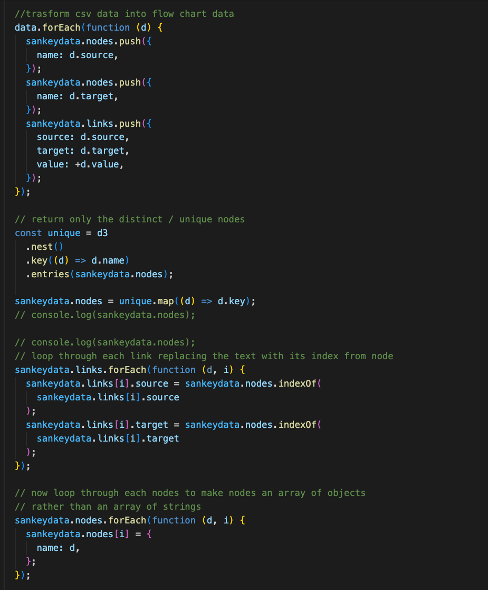
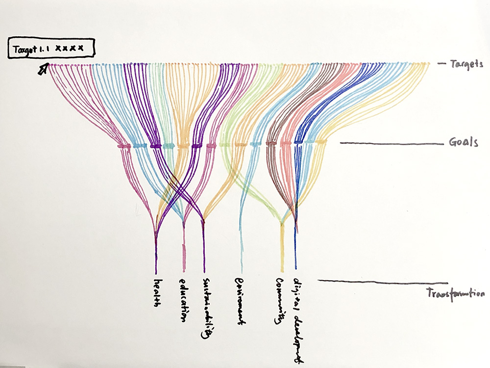
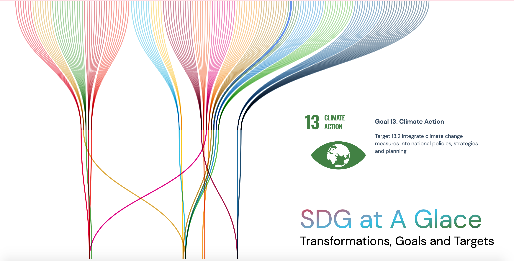
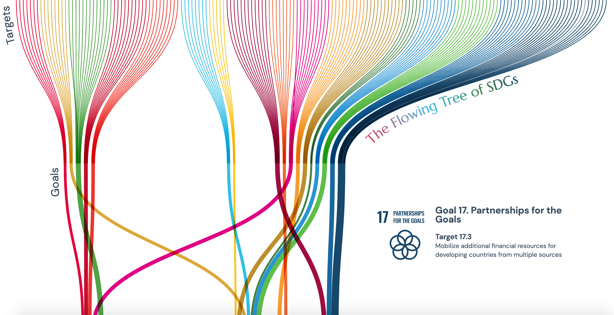

This visualization is the second qualitative project in my Major Studio 1 class as part of the study of the MS Data Visualization program. It turns SDG's multi-layer structure into a Sankey tree format. I customized the Sankey diagram by changing the layout design and adding in additional SVG elements.

### Data

The data includes 6 SDG transformation focuses, 17 goals and 169 targets. I converted the data programatically from CSV to a Sankey node/link file format.

### Prototype

Thanks to professor Richard The's guidance, I went through 3 rounds of iterations and was able to significantly improve the aesthetics and readability of the graph. The chart is built with d3.js and vanilla Javascript.

#### Sketch

 

[Current Iteration](https://muons.com/msdv-major-studio-1/02_qualitative_project/sankey)

In this final iternation, I was able to customize the existing Sankey format and add in additional SVG elements and bind data to it. I also further improved the hover-over effect so the entire hierachical structure can be highlighted instead of just highlighting the links and nodes separately.

### Previous versions

#### Version 1

#### Version 2

In the first two iterations I was having trouble formatting the Sankey chart freely to suite my design and functional needs. I spent a signficant amount of time understanding the source code better and was able to eventually improve the visualization to its current iteration.
